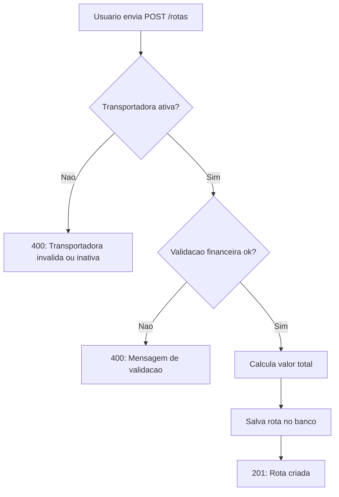
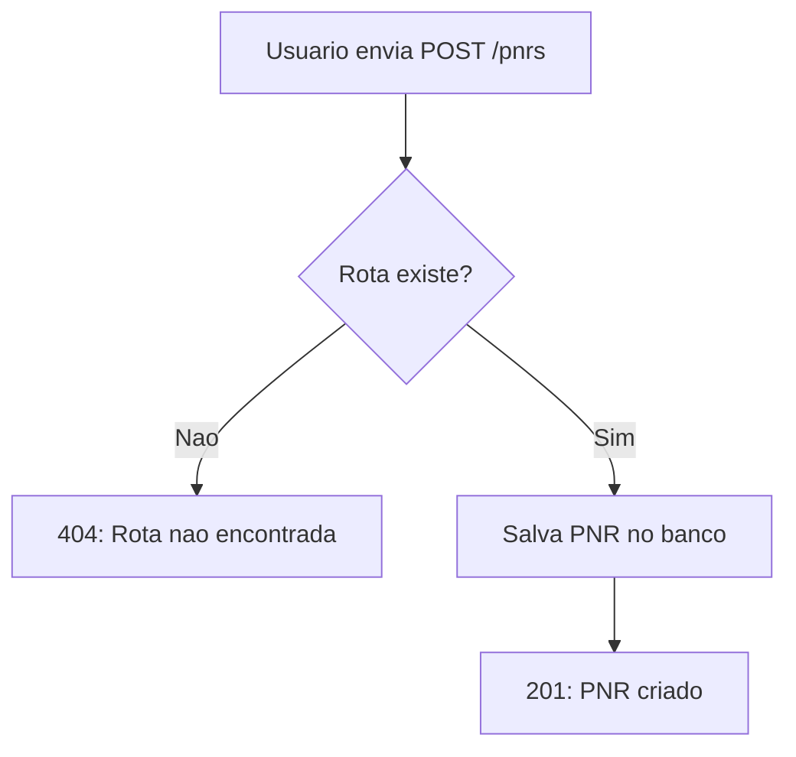
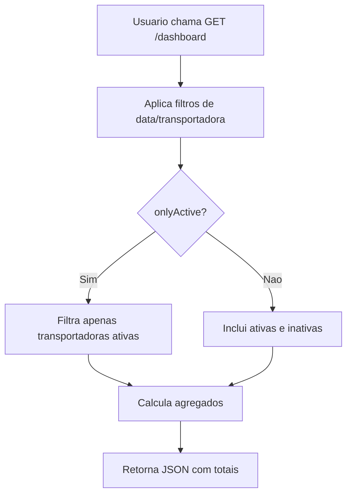
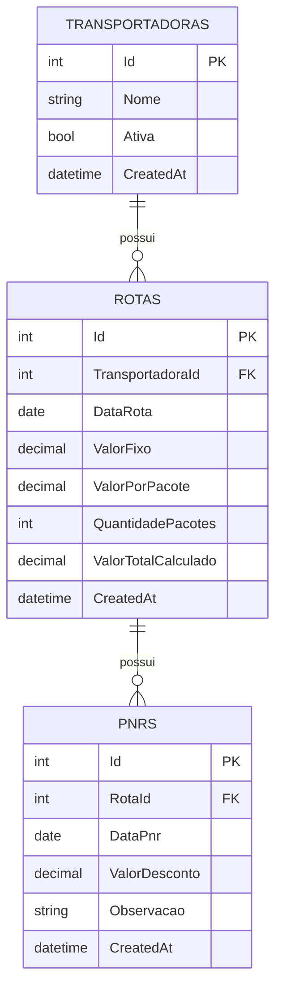

# PRD – Sistema de Controle de Ganhos por Transportadora e Rotas

## 1. Visão do produto

Criar um sistema para controle operacional e financeiro de transportadoras, permitindo o cadastro de rotas diárias, definição de valores por rota e por pacote, controle de PNR (ocorrências não resolvidas) e acompanhamento em tempo real dos ganhos previstos e realizados.

---

## 2. Objetivo do produto

Permitir que o usuário acompanhe:

- quanto está ganhando no momento;
- quanto está deixando de ganhar por ocorrências (PNR);
- quanto deverá receber por dia e por transportadora;
- quanto ganhou em períodos passados.

---

## 3. Stakeholders

- Usuário final (operador ou gestor de entregas)
- Time de desenvolvimento
- Área de produto / negócio

---

## 4. Escopo

### 4.1. Dentro do escopo

- Cadastro de transportadoras
- Cadastro de rotas diárias
- Definição de valores por rota e por pacote
- Registro de PNR
- Consolidação automática de valores
- Dashboard de ganhos em tempo real
- Consulta de previsões de recebimento
- Histórico de ganhos

### 4.2. Fora do escopo

- Integração bancária
- Emissão de nota fiscal
- Integração com sistemas externos de logística
- Controle avançado de usuários e permissões

---

## 5. Entidades principais

### Transportadora

- Id
- Nome
- Status (ativa/inativa)
- Data de criação

### Rota

- Id
- Transportadora
- Data da rota
- Valor fixo da rota (opcional)
- Valor por pacote (opcional)
- Quantidade de pacotes
- Valor total calculado
- Data de criação

### PNR

- Id
- Rota associada
- Data da PNR (apenas para controle)
- Valor do desconto
- Observação (opcional)

---

## 6. Requisitos funcionais

### 6.1. Cadastro de transportadora

O sistema deve permitir:

- cadastrar transportadora;
- editar transportadora;
- inativar transportadora.

Campo obrigatório:

- nome.

---

### 6.2. Cadastro de rota

O sistema deve permitir:

- cadastrar mais de uma rota para a mesma transportadora no mesmo dia;
- associar a rota a uma transportadora e a uma data.

Campos obrigatórios:

- transportadora;
- data da rota.

Campos financeiros:

- valor fixo da rota (opcional);
- valor por pacote (opcional);
- quantidade de pacotes (obrigatória quando existir valor por pacote).

---

### 6.3. Regra de cálculo da rota

É obrigatório informar pelo menos um dos campos:

- valor fixo da rota
- valor por pacote

Quando ambos forem informados:

- o valor total da rota é a soma de `valor fixo + (valor por pacote * quantidade de pacotes)`.

---

## 7. POC implementada (.NET + React)

### 7.1. Stack

- Backend: ASP.NET Core 9 (Minimal API) + Entity Framework Core + SQLite
- Frontend: React + Vite
- Banco local: arquivo `backend/Api/controle-ganhos.db`

### 7.2. Funcionalidades implementadas

- Cadastro de transportadora (criar, editar, inativar, reativar)
- Cadastro de rota com validações de regra de negócio
- Registro e remoção de PNR
- Cálculo automático do valor total da rota
- Dashboard com ganhos brutos, descontos PNR, ganhos líquidos, rotas e pacotes
- Filtro de dashboard por período e transportadora
- Previsão por dia/transportadora com tabela detalhada
- Histórico diário por período com totalizadores
- Históricos colapsáveis de rotas, PNRs e transportadoras (incluindo inativas) cadastrados

### 7.3. Regras de validação da rota

- É obrigatório informar `valorFixo` e/ou `valorPorPacote`.
- Se houver `valorPorPacote`, `quantidadePacotes` deve ser maior que zero.
- Valores financeiros não podem ser negativos.

### 7.4. Endpoints principais

Base URL: `http://localhost:5151/api`

#### Transportadoras

- `GET /transportadoras?includeInactive=true|false`
  - Lista transportadoras; por padrao traz apenas ativas.
- `POST /transportadoras`
  - Body:
    - `nome` (string, obrigatorio)
- `PUT /transportadoras/{id}`
  - Body:
    - `nome` (string, obrigatorio)
    - `ativa` (boolean)
- `PATCH /transportadoras/{id}/inativar`
- `PATCH /transportadoras/{id}/reativar`

#### Rotas

- `GET /rotas?startDate=yyyy-MM-dd&endDate=yyyy-MM-dd&transportadoraId={id}`
- `POST /rotas`
  - Body:
    - `transportadoraId` (int, obrigatorio)
    - `dataRota` (yyyy-MM-dd, obrigatorio)
    - `valorFixo` (decimal, opcional)
    - `valorPorPacote` (decimal, opcional)
    - `quantidadePacotes` (int, obrigatorio se houver valor por pacote)
- `PUT /rotas/{id}`
  - Body igual ao POST

#### PNRs

- `GET /pnrs?rotaId={id}`
- `POST /pnrs`
  - Body:
    - `rotaId` (int, obrigatorio)
    - `dataPnr` (yyyy-MM-dd, obrigatorio)
    - `valorDesconto` (decimal, obrigatorio)
    - `observacao` (string, opcional)
- `DELETE /pnrs/{id}`

#### Dashboard

- `GET /dashboard/summary?startDate=yyyy-MM-dd&endDate=yyyy-MM-dd&transportadoraId={id}&onlyActive=true`
- `GET /dashboard/previsao?startDate=yyyy-MM-dd&endDate=yyyy-MM-dd&transportadoraId={id}&onlyActive=true`
- `GET /dashboard/historico?startDate=yyyy-MM-dd&endDate=yyyy-MM-dd&transportadoraId={id}&onlyActive=true`

**Nota:** Os parametros `transportadoraId` e `onlyActive` sao opcionais em todos os endpoints de dashboard. Use `onlyActive=true` para filtrar apenas dados de transportadoras ativas.

### 7.5. Fluxogramas (Mermaid)

#### Cadastro de rota



#### Registro de PNR



#### Dashboard (summary/previsao/historico)



---

## 8. Como executar localmente

### 8.1. Pré-requisitos

- .NET SDK 9+
- Node.js 20+

### 8.2. Backend

```bash
cd backend/Api
dotnet restore
dotnet run
```

API disponível em `http://localhost:5151`.

### 8.3. Frontend

Em outro terminal:

```bash
cd frontend
npm install
npm run dev
```

Aplicação disponível em `http://localhost:5173`.

---

## 9. Melhorias de interface implementadas

### 9.1. Dashboard

- **Filtro por transportadora**: permite visualizar dados consolidados de uma transportadora específica (ativas ou inativas) ou de todas
- **Filtro por período**: selecione intervalo de datas customizado para análise
- **Filtro "Apenas ativas"**: checkbox que exclui dados de transportadoras inativas tanto da exibição quanto dos cálculos do dashboard, previsão e histórico
  - **Só aparece quando "Todas" está selecionado** no filtro de transportadora
  - Ao selecionar uma transportadora específica, o filtro "Apenas ativas" é ocultado automaticamente
  - Transportadoras inativas aparecem com indicador "(Inativa)" no select
- **Métricas em tempo real**: ganhos brutos, descontos PNR, ganhos líquidos, total de rotas e pacotes

### 9.2. Visualização de dados

- **Tabelas com cabeçalhos**: seções de Previsão e Histórico agora exibem dados tabulares com colunas organizadas
- **Históricos colapsáveis**: seções de rotas e PNRs cadastrados podem ser expandidas/recolhidas com um clique
- **Contadores visuais**: exibem quantidade de registros nos históricos colapsados
- **Formatação monetária**: todos os valores financeiros em padrão brasileiro (R$)

### 9.3. Formulários

- **Validação em tempo real**: campos obrigatórios e regras de negócio validadas no frontend e backend
- **Seleção simplificada**: dropdowns para transportadoras e rotas com informações contextuais
- **Feedback visual**: mensagens de erro claras e estado de carregamento durante operações

### 9.4. Tema claro/escuro

- **Toggle switch moderno**: chave deslizante estilo iOS no header para alternar entre tema claro e escuro
- **Ícones visuais**: ☀️ (sol) e 🌙 (lua) em cada lado do switch para identificação intuitiva
- **Preferência salva**: tema escolhido é armazenado no localStorage do navegador
- **Transições suaves**: mudanças de cor com animação de 0.3s
- **Cores otimizadas**: paleta de cores ajustada para ambos os modos garantindo legibilidade

---

## 10. Consulta direta ao banco de dados

### 10.1. Instalação do SQLite CLI (opcional)

```bash
winget install SQLite.SQLite
```

Após instalação, feche e reabra o terminal.

### 10.2. Acesso ao banco

No terminal (CMD ou PowerShell), execute:

```bash
cd backend/Api
sqlite3 controle-ganhos.db
```

### 10.3. Comandos úteis

```sql
-- Listar tabelas
.tables

-- Ver estrutura de uma tabela
.schema Transportadoras

-- Consultar transportadoras ativas
SELECT * FROM Transportadoras WHERE Ativa = 1;

-- Consultar rotas com valores calculados
SELECT Id, DataRota, ValorTotalCalculado, QuantidadePacotes 
FROM Rotas 
ORDER BY DataRota DESC 
LIMIT 10;

-- Consultar total de descontos PNR por transportadora
SELECT t.Nome, SUM(p.ValorDesconto) as TotalDescontos
FROM Pnrs p
JOIN Rotas r ON p.RotaId = r.Id
JOIN Transportadoras t ON r.TransportadoraId = t.Id
GROUP BY t.Nome
ORDER BY TotalDescontos DESC;

-- Sair do SQLite
.quit
```

### 10.4. Visualização gráfica

Alternativamente, use ferramentas GUI:

- **DB Browser for SQLite**: [https://sqlitebrowser.org/](https://sqlitebrowser.org/)
- **Extensão SQLite no VS Code**: `alexcvzz.vscode-sqlite`

Abra o arquivo `backend/Api/controle-ganhos.db` diretamente nessas ferramentas para consultas visuais.

---

## 11. Estrutura técnica

### 11.1. Backend

- **Minimal API**: endpoints RESTful enxutos e performáticos
- **Entity Framework Core**: ORM para acesso ao banco SQLite
- **ReferenceHandler.IgnoreCycles**: evita erros de serialização JSON em relacionamentos bidirecionais
- **Validações em camadas**: regras de negócio aplicadas antes da persistência

### 11.2. Frontend

- **React 18**: componentes funcionais com hooks
- **Vite**: build tool rápida com HMR (Hot Module Replacement)
- **Fetch API nativa**: requisições HTTP sem dependências externas
- **Chart.js + react-chartjs-2**: biblioteca de gráficos interativos
- **CSS modular**: estilização organizada em App.css
- **Componentes de gráficos**: centralizados em [frontend/src/Charts.jsx](frontend/src/Charts.jsx)

### 11.3. Banco de dados

- **SQLite**: arquivo local `controle-ganhos.db`
- **Criação automática**: via `EnsureCreated()` no startup da API
- **Relacionamentos**: FK entre Rotas→Transportadoras e PNRs→Rotas

### 11.4. Modelo relacional

Relacionamentos principais:

- **Transportadoras (1) → (N) Rotas**
- **Rotas (1) → (N) PNRs**

Regras:

- Uma **Transportadora** pode ter varias **Rotas**.
- Cada **Rota** pertence a uma unica **Transportadora**.
- Uma **Rota** pode ter varios **PNRs**.
- Cada **PNR** pertence a uma unica **Rota**.

Diagrama (Mermaid):



---

## 12. Visualizações gráficas

A aplicação oferece visualizações gráficas interativas para facilitar a análise de dados, com controle de alternância entre modos de visualização.

### 12.1. Controle de visualização (Segmented Control)

Localizado no header ao lado do toggle de tema, permite escolher entre:

- **📊 Gráficos**: exibe apenas visualizações gráficas
- **📋 Tabelas**: exibe apenas tabelas de dados (modo padrão original)

A preferência de visualização é salva no localStorage do navegador.

### 12.2. Gráficos disponíveis

#### Resumo Financeiro
- **Tipo**: Gráfico de barras
- **Dados**: Ganhos Brutos vs Ganhos Liquidos
- **Localização**: Logo após os cards de métricas do dashboard

#### Previsão por Transportadora
- **Tipo**: Gráfico de barras
- **Dados**: Ganho liquido agrupado por transportadora
- **Cores**: Paleta de 6 cores para diferenciar transportadoras
- **Localização**: Seção "Previsão por Dia e Transportadora"

#### Distribuição por Tipo de Rota
- **Tipo**: Gráfico de rosca (Doughnut)
- **Dados**: Quantidade de rotas com Valor Fixo, Por Pacote e Ambos
- **Filtro**: respeita período, transportadora e apenas ativas
- **Localização**: Seção "Previsão por Dia e Transportadora"

#### Evolução dos Recebimentos
- **Tipo**: Gráfico de linha
- **Dados**: Ganho líquido diário + acumulado ao longo do período
- **Recursos**: Preenchimento de área sob as linhas, tooltips formatados
- **Localização**: Seção "Histórico Diário"

### 12.3. Biblioteca de gráficos

- **Chart.js**: biblioteca principal (~200KB)
- **react-chartjs-2**: wrapper React para Chart.js
- **Componentes**: centralizados em [frontend/src/Charts.jsx](frontend/src/Charts.jsx)
- **Responsividade**: gráficos ajustam-se automaticamente ao container
- **Formatação**: valores monetários formatados em R$ (pt-BR)
- **Animações**: transições suaves em 0.4s

---

## 13. Próximos passos sugeridos

- Implementar autenticação e autorização (JWT)
- Adicionar paginação nos históricos
- Exportar relatórios em PDF ou Excel
- Implementar soft delete para transportadoras e rotas
- Notificações em tempo real (SignalR)
- Testes automatizados (xUnit + Jest/Vitest)
- Adicionar mais tipos de gráficos (scatter, heatmap, timeline)

---

## 14. Deploy gratuito (Fly.io + Vercel)

### 14.1. Deploy do Backend (Fly.io)

**Requisitos:**
- Conta no [fly.io](https://fly.io)
- CLI do Fly instalado: `curl -L https://fly.io/install.sh | sh`
- GitHub CLI (opcional, mas recomendado)

**Passos:**

1. Login no Fly:
   ```bash
   fly auth login
   ```

2. Na raiz do backend, fazer deploy:
   ```bash
   cd backend/Api
   fly launch --name scgtr-api  # Escolha um nome único
   ```

3. Na primeira vez, o Fly vai:
   - Detectar Dockerfile
   - Criar volume persistente (para SQLite)
   - Publicar a app

4. Salvar a URL (algo como `https://scgtr-api.fly.dev`)

**Monitorar:**
   ```bash
   fly logs -a scgtr-api
   fly status -a scgtr-api
   ```

### 14.2. Deploy do Frontend (Vercel)

**Requisitos:**
- Conta no [vercel.com](https://vercel.com)
- Projeto no GitHub

**Passos:**

1. Ir em [vercel.com/new](https://vercel.com/new)
2. Importar repositório (scgtr)
3. Em **Environment Variables**, adicionar:
   - `VITE_API_URL` = `https://scgtr-api.fly.dev/api` (URL do seu backend Fly)
4. Clicar em Deploy

Vercel vai:
- Detectar React + Vite
- Fazer build automático
- Disponibilizar em URL tipo `https://scgtr.vercel.app`

### 14.3. Testar produção

1. Abrir frontend em produção
2. Ir para **Filtro do Dashboard** e testar:
   - ✅ Carregar dados
   - ✅ Criar transportadora
   - ✅ Criar rota
   - ✅ Registrar PNR
   - ✅ Ver gráficos

### 14.4. Notas importantes

- **Banco em Vercel** é **somente leitura** (para front estático)
- **Banco no Fly** é **persistente** (volume `/data`)
- Se precisar resetar dados, use: `fly ssh console -a scgtr-api`
- CORS já configurado para aceitar `*.vercel.app`
- Arquivo `.env.example` serve como referência (não versionar `.env`)

### 14.5. Custo esperado

- **Fly.io**: Gratuito até 3 máquinas compartilhadas + 3GB storage
- **Vercel**: Gratuito para projetos estáticos (React)
- **Total**: Pode ficar 100% gratuito dentro dos limites
